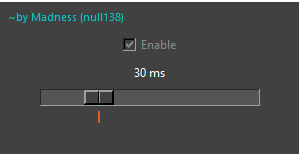

# [EN]
***Author***: **Madness (null138)** | [Steam Profile](http://steamcommunity.com/profiles/76561198098349799) | [Discord Server](https://discord.gg/SHW82GMrV4)

# Scroll Optimizer

Scroll Optimizer is a Windows tool designed to make the bhopping mechanic in certain shooting games smoother and more consistent by throttling and queuing mouse scroll inputs.
Instead of sending rapid or excessive inputs, the tool processes scroll events at a controlled interval, providing improved timing consistency and smoother execution.

# This results in:
- More stable bhop timing
- Reduced input burst inconsistency
- Smoother overall scroll behavior

# Important Clarification
This tool does NOT:
- Increase the number of inputs
- Automatically generate scroll inputs without user input
- Spam or simulate additional actions
It only delays and regulates existing user input.

# How to Use
- Download and Run
  - If you have Python installed, download the script and run it.
  - If not, download the compiled executable from the Releases section.
- Make sure the Enable button is toggled on.
- Join the Game
  - Try bhopping in-game.
  - If it doesn’t feel right, adjust the slider to fine-tune the values until it matches your preference.
- Default Settings
  - The default 30ms interval works well for most users.
  - An orange visual marker shows the default 30ms value.

# Ethical & Usage Notice
From a functional perspective, this tool does not create artificial input or automate gameplay behavior. It simply delays existing input by a specified interval.
However:
- Some anti-cheat systems that restrict tools such as:
  - AutoHotkey (AHK)
  - Macros
  - Input manipulation utilities
  - Low-level input hooks
- May flag or block this tool.

# ⚠ Disclaimer
**I take no responsibility for any consequences resulting from the use of this software, including but not limited to account restrictions, bans, or other penalties enforced by game developers or anti-cheat systems.**
**Use at your own risk.**

# License
This project is released under the MIT License (Author Credit Required).

# 

# [RU/РУССКИЙ]
***Автор***: **Madness (null138)** | [Профиль Steam](http://steamcommunity.com/profiles/76561198098349799) | [Discord Сервер](https://discord.gg/SHW82GMrV4)

# Scroll Optimizer

Scroll Optimizer — это инструмент для Windows, предназначенный для более плавного и стабильного выполнения механики bhop в некоторых шутерах за счёт ограничения и очередности обработки прокрутки колеса мыши.
Вместо отправки слишком частых или избыточных сигналов инструмент обрабатывает события прокрутки с контролируемым интервалом, обеспечивая более стабильный тайминг и плавное выполнение.

# Это приводит к:
- Более стабильному таймингу bhop
- Снижению нестабильности при резких всплесках ввода
- Более плавному поведению прокрутки в целом

# Важное уточнение
Этот инструмент НЕ:
- Увеличивает общее количество нажаний  
- Автоматически генерирует прокрутку без участия пользователя
- Спамит или имитирует дополнительные действия
Он только задерживает и регулирует существующий ввод пользователя.

# Как использовать
- Скачайте и запустите
  - Если у вас установлен Python, скачайте скрипт и запустите его.
  - Если нет — скачайте скомпилированный исполняемый файл из раздела Releases.
- Убедитесь, что кнопка Enable включена.
- Зайдите в игру
  - Попробуйте выполнить распрыжку в игре как обычно.
  - Если ощущения не подходят, настройте ползунок, чтобы подобрать оптимальное значение под себя.
- Настройки по умолчанию
  - Интервал по умолчанию 30 мс подходит большинству пользователей.
  - Оранжевый визуальный маркер указывает значение по умолчанию 30 мс.

# Этическое и правовое уведомление
С функциональной точки зрения данный инструмент не создаёт искусственный ввод и не автоматизирует игровой процесс. Он лишь задерживает существующий ввод на заданный интервал.
Однако:
- Некоторые античит-системы, ограничивающие использование таких инструментов, как:
  - AutoHotkey (AHK)
  - Макросы
  - Утилиты для манипуляции вводом
  - Низкоуровневые перехватчики ввода
- Могут обнаружить или заблокировать этот инструмент.

# ⚠ Отказ от ответственности
**Я не несу ответственности за любые последствия, возникшие в результате использования данного программного обеспечения, включая, но не ограничиваясь, ограничениями аккаунта, блокировками или другими санкциями со стороны разработчиков игр или античит-систем.**
**Используйте на свой страх и риск.**

# Лицензия
Проект распространяется по лицензии MIT (с обязательным указанием автора).
